# Dragon
Dragon is a library for geometry processing. 

## What can dragon do?
### DragonView2D
- Voronoi diagram and Delaunay triangulation

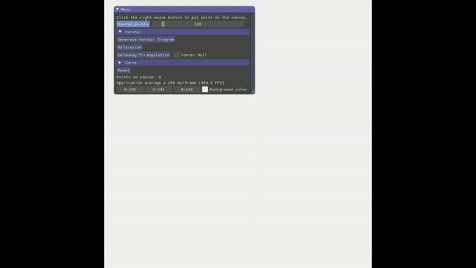
- 7 kinds of Curves


### DragonView3D
#### Mesh
- Mesh Curvature
- Mesh Smoothing
- Mesh Parameterization for model with border
- Mesh simplification

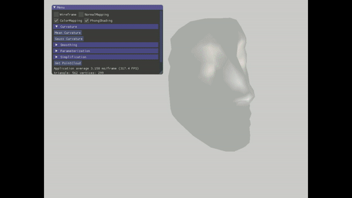

- Loop subdivision (updated in 2021/3/10)

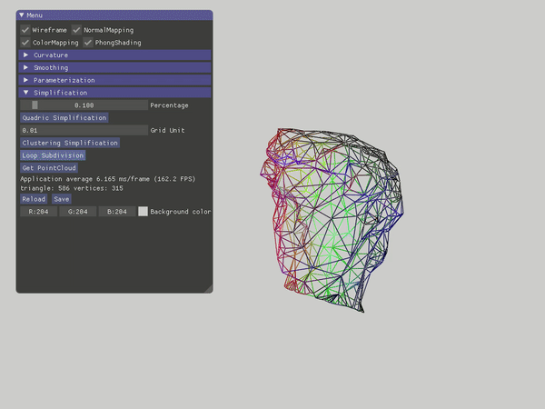
- Mesh to SDF (updated in 2021/7/2)

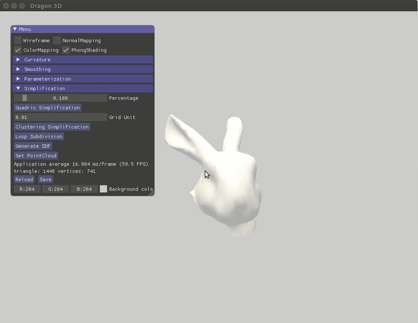

We can estimate the quality of mesh2sdf algorithm by applying marching-cube algorithm on generated sdf to extract a new mesh, here are some results:

**Bunny_head.obj, voxel resolution: 0.01**

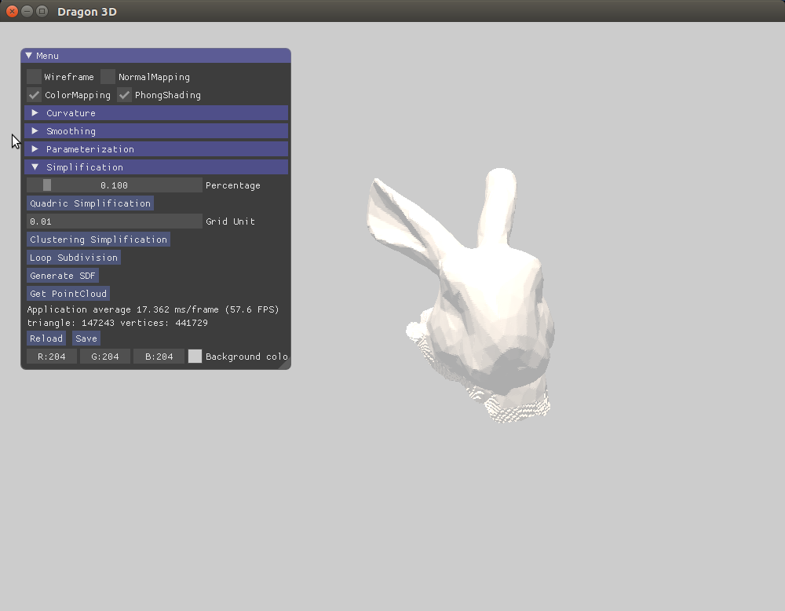

**happy_vrip.ply, voxel resolution: 0.002**

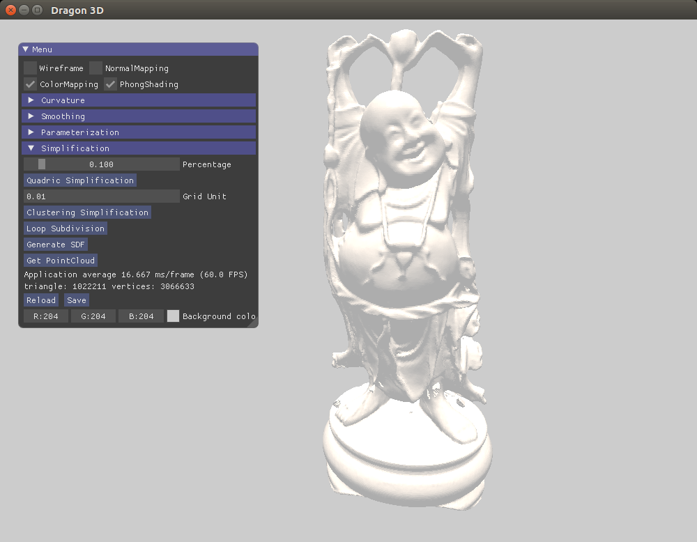
#### Point Cloud
- Point Cloud Processing
- Octree
- Simplified RBF reconstruction and Poisson reconstruction

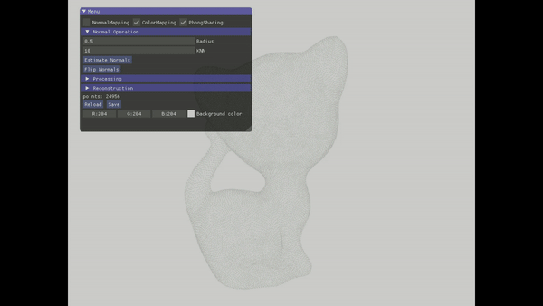

##### Reconstructed model using RBF and Poisson
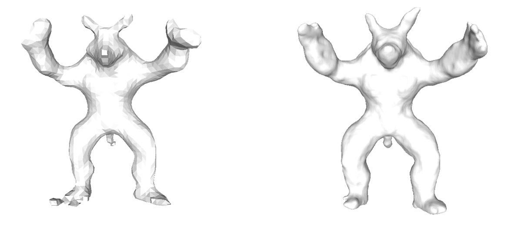

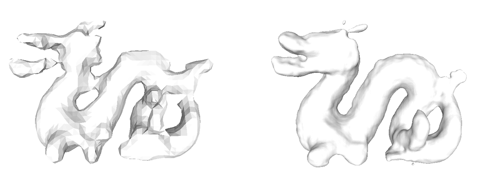

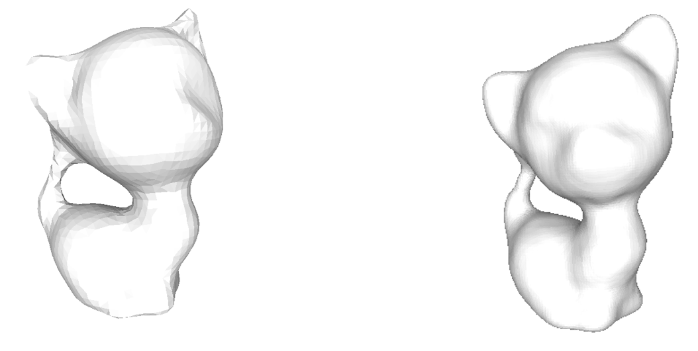

##### Reconstructed model with different depth (3-7)
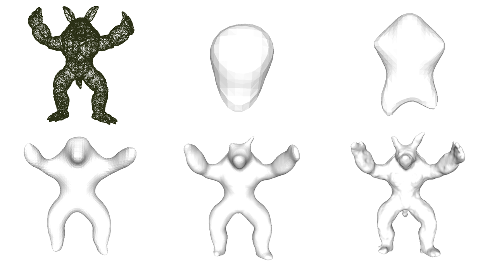

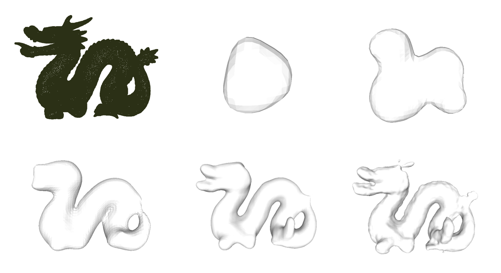

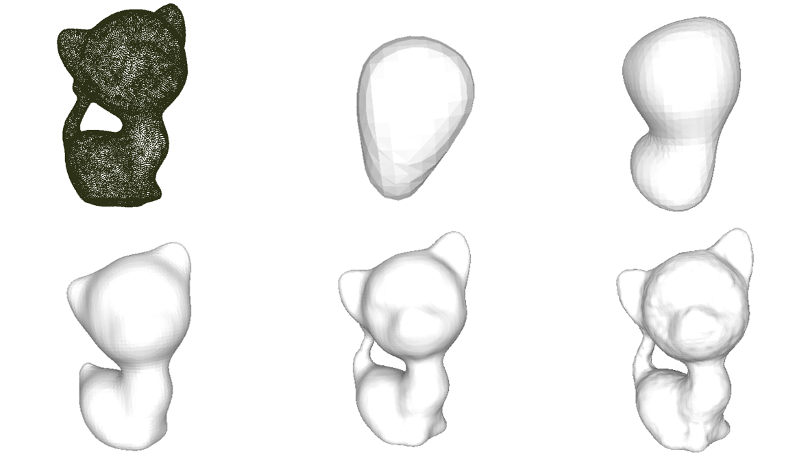

#### Tubular Shape Reconstruction from Skeleton Representation
To better understand this work, please refer to [A Geometric Algorithm for Tubular Shape Reconstruction from Skeletal Representation](https://arxiv.org/pdf/2402.12797v2).


#### Extract Tree Graph and Key-node Graph from Skeleton Representation
**Skeleton Representation**
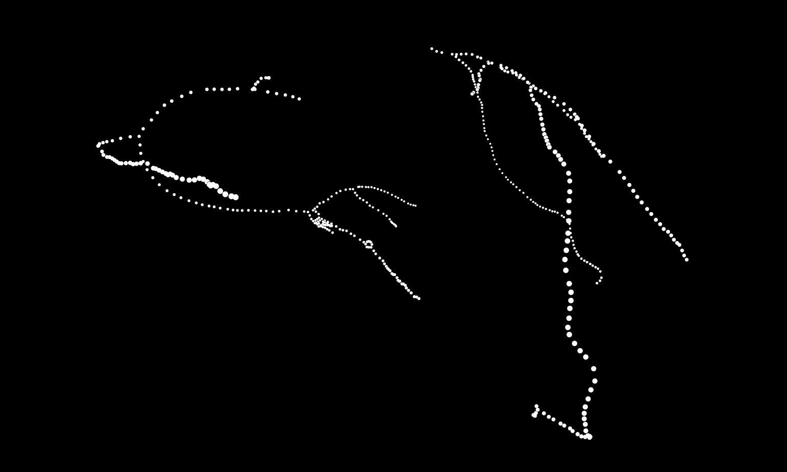
**Tree Graph from Skeleton**
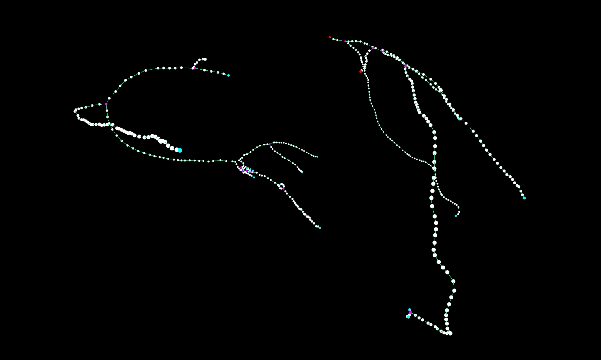
**Key-node Graph from Skeleton (End points and bifurcation points are considered as key-nodes)**
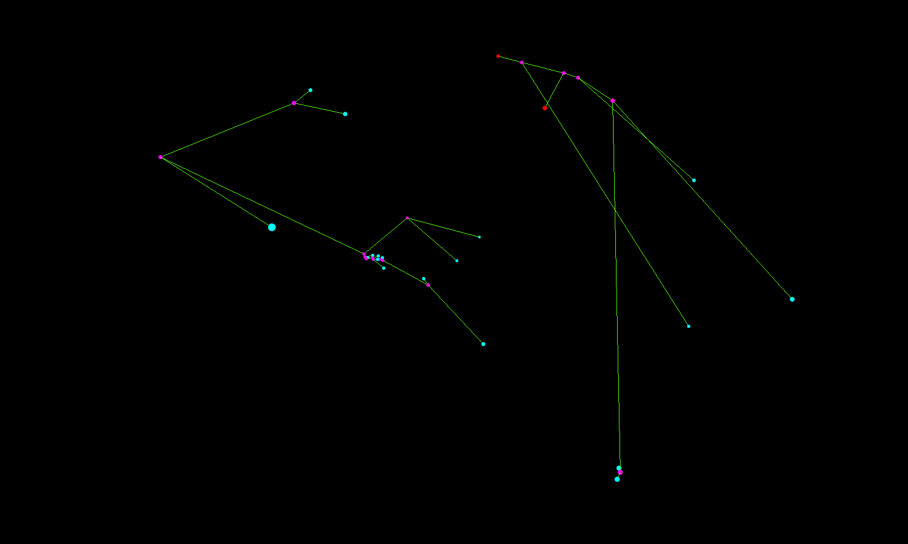
### Other  
- SpiderMan (The curve is cubic spline):

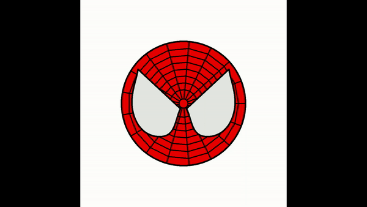

## Get Started
Prerequisites:
- OpenGL, GLUT, GLEW

Other 3rd libraries are packaged into 3rdparty (imgui)
```
mkdir build
cd build
cmake .. && make -j
```
Refer to [https://github.com/MyEvolution/GAMES102](https://github.com/MyEvolution/GAMES102) for more information.

## Acknowledgement

Thanks to [GAMES 102](http://staff.ustc.edu.cn/~lgliu/Courses/GAMES102_2020/default.html), a large part of this library comes from the assignments of this course.

## TODO
Remeshing
## ChangeLog
- 2021/3/10: Loop subdivision
- 2021/3/14: Apply real Phong model on visualization as following(the old shader is from elastic fusion and flashfusion, and the color on each vertex will not change as the moving object):
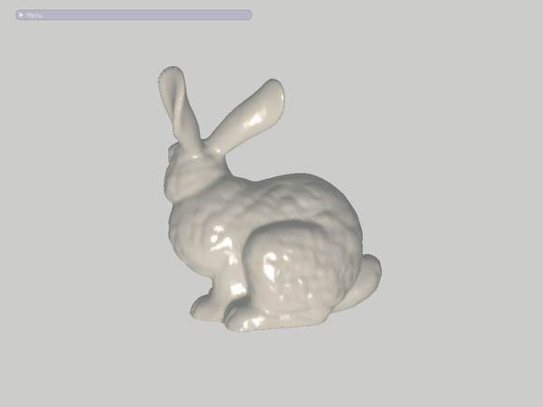
- 2021/7/2: Generate sdf from triangle mesh (`Mesh2SDF` in `Mesh2SDF.h`). 
- 2023/9/25: Generate sdf from skeleton representation (`CenterLine2SDF` in `Mesh2SDF.h`)
- 2023/12/7: Generate tree graph from skeleton representation (Refer to `app/Centerline2SDF.cpp`)
## License 
Under the MIT License, see http://opensource.org/licenses/MIT.